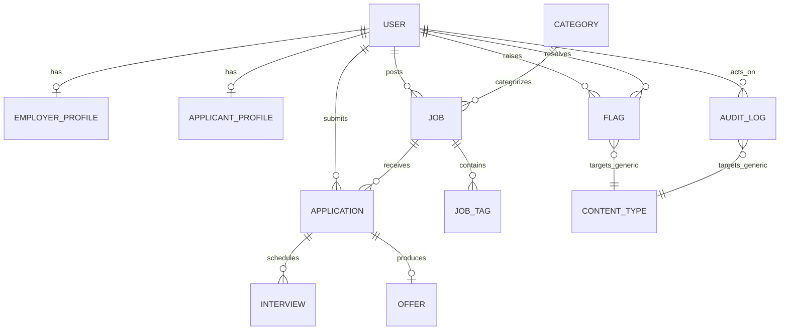

# Inkboard — Editorial Job Board Platform

**Inkboard** is a modern, editorial job-board web application built with Django 5, Vanilla CSS, HTMX, and SQLite/PostgreSQL. It connects high-growth companies with talented job seekers through an intuitive hiring workflow.

---

## Features & Highlights

### 1. Dual-Role Architecture & Authentication
- **Role Switch**: Public signup with instant Applicant vs. Employer role toggle.
- **Split-Screen Authentication**: Paper-grid aesthetic, live role tab coloring (Teal for Applicants, Coral for Employers, Plum for Admins).
- **Security**: Account suspension enforcement, login rate limiting (5 attempts / 5 mins, HTTP 429), and secure session cookies in production.

### 2. Role Dashboards
- **Employer Dashboard**: Metrics for open jobs, total applicants, shortlisted candidates, and interviews scheduled in the next 7 days (zero N+1 queries).
- **Applicant Dashboard**: Status breakdown, upcoming interview ticket cards, profile completeness meter, and recent application timeline.
- **Admin Panel (`/admin-panel/`)**: Standalone platform control centre for user management, employer verification queue, job moderation, and audit logs.

### 3. Employer Job Management & Kanban Pipeline
- **CRUD Operations**: Status tabs (Draft / Open / Closed / Removed), salary range validation, and live applicant-view preview card rendered via HTMX.
- **Candidate Pipeline**: Per-job Kanban board with columns for application stages (`Applied`, `Reviewing`, `Shortlisted`, `Interview`, `Offer`, `Hired`, `Rejected`).
- **Interactive Drawer**: Slide-over panel displaying candidate profile, cover letter, resume download, interview scheduler, and outcome logger.
- **State Machine**: Enforced transitions in a single service layer; dispatches notifications upon stage updates.

### 4. Applicant Experience
- **Discovery**: Filter by category, location, and salary with instant search and HTMX pagination.
- **Apply Flow**: Cover letter and resume upload with snapshotting; supports reusing profile master resumes.
- **My Applications**: Visual timeline of application progress with stamp chips.

### 5. Production Hardening (Stage 7)
- **Settings Split**: Modular configuration under `inkboard/settings/` (`base.py`, `dev.py`, `prod.py`).
- **WhiteNoise & Gunicorn**: Static asset compression and caching via WhiteNoise; multi-worker WSGI via Gunicorn.
- **Protected Media Serving**: Sensitive resumes are strictly restricted to the owning applicant, the hiring employer, and platform administrators.
- **Resume Validation**: Strict upload enforcement (only `.pdf`, `.doc`, `.docx` up to 30 MB).
- **Database Optimization**: Composite indexes on `Job.status`, `Application.status`, and foreign keys.
- **UI Hardening**: Toast notification system, HTMX loading spinners, accessible focus rings, and WCAG AA contrast tokens.

---

## Entity Relationship Diagram (ERD)



This schema captures the core relationships in Inkboard:
- `User` is the shared identity for applicants, employers, and admins.
- `EmployerProfile` and `ApplicantProfile` extend the user with company and candidate-specific metadata.
- `Category` groups jobs, and each `Job` can have multiple `JobTag` entries.
- Each `Application` belongs to a single applicant and a single job, and can generate one `Offer` and many `Interview` records.
- `Flag` and `AuditLog` allow moderation and review workflows across platform content.

---

## Quickstart

### Prerequisites
- Python 3.11+
- Virtual environment tool (`venv` or `uv`)

### 1. Installation
```bash
# Clone the repository
git clone https://github.com/your-username/inkboard.git
cd inkboard

# Create and activate virtual environment
python -m venv .venv
source .venv/bin/activate  # On Windows: .venv\Scripts\activate

# Install dependencies
pip install -r requirements.txt
```

### 2. Database & Demo Data
```bash
# Apply migrations
python manage.py migrate

# Seed rich demonstration data
python manage.py seed_demo --flush
```

### 3. Run Development Server
```bash
python manage.py runserver
```
Visit [http://localhost:8000/](http://localhost:8000/) in your browser.

---

## Seed Accounts

When seeded via `python manage.py seed_demo`, the following accounts are ready to use:

| Role | Username / Email | Password | Description |
|---|---|---|---|
| **Admin** | `admin` (`admin@inkboard.dev`) | `admin1234` | Full superadmin platform control at `/admin-panel/` |
| **Employer** | `employer1@inkboard.dev` | `employer1234` | Synapse Labs (Verified employer with open jobs & pipeline) |
| **Employer** | `employer2@inkboard.dev` | `employer1234` | Orbit Systems (Employer with candidate applications) |
| **Applicant** | `applicant1@inkboard.dev` | `applicant1234` | Alex Rivera (Applied to multiple positions) |
| **Applicant** | `applicant2@inkboard.dev` | `applicant1234` | Sam Chen (Candidate with scheduled interviews) |

---

## Docker & Production Deployment

### Build and Run with Docker
```bash
docker build -t inkboard:latest .

docker run -d -p 8000:8000 --env-file .env.production inkboard:latest
```

---

## Running the Test Suite
```bash
# Run all tests
python manage.py test

# Run tests by app
python manage.py test accounts
python manage.py test jobs
python manage.py test applications
python manage.py test moderation
python manage.py test core
```
